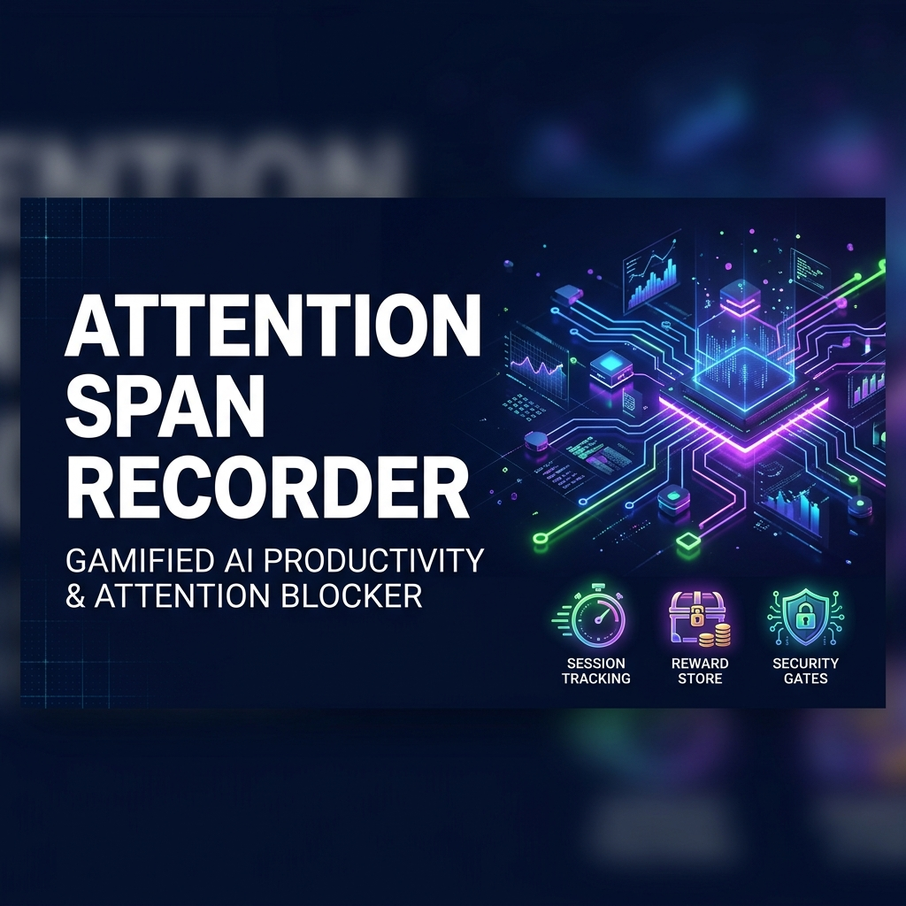
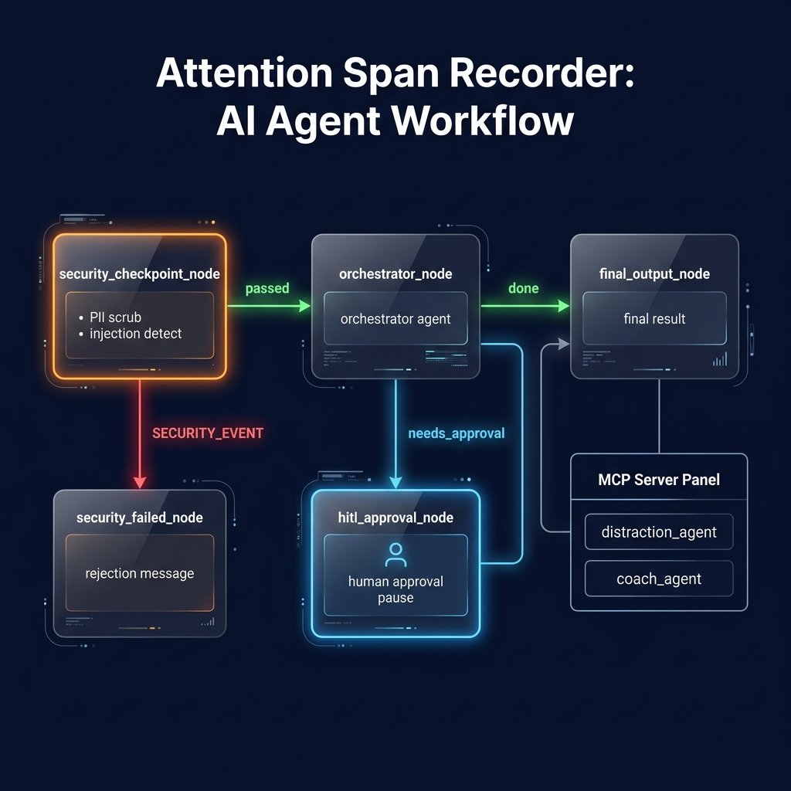
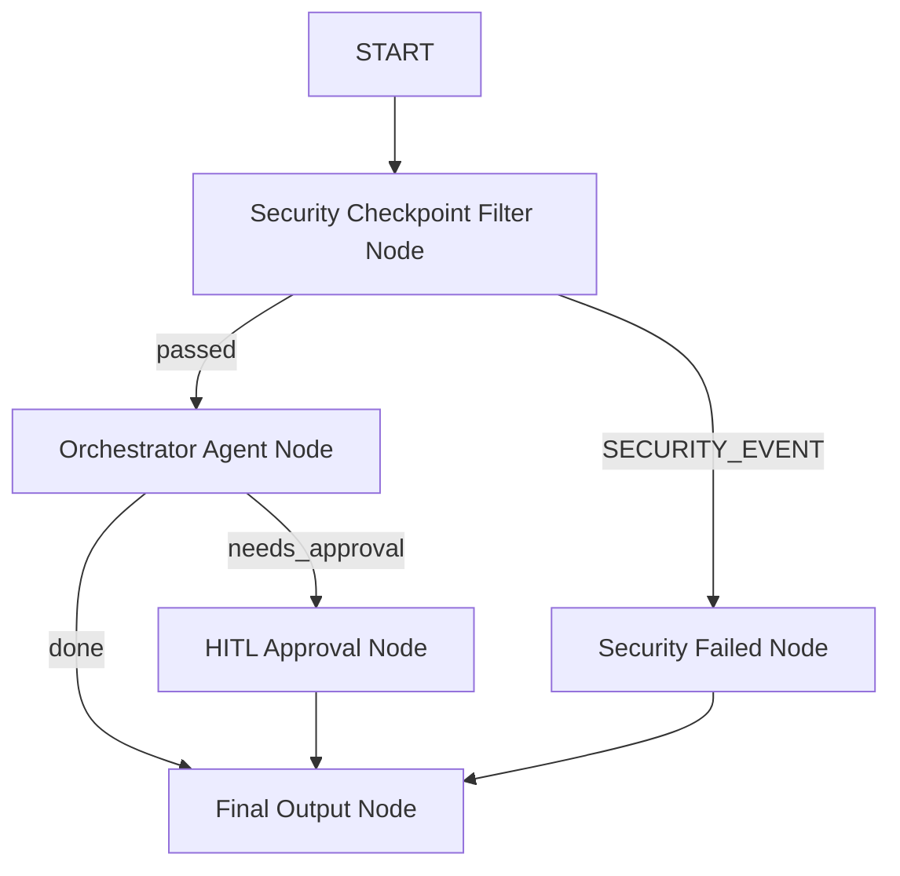

# Attention Span Recorder

AI-Powered Productivity, Gamification, and Focus Tracking System.

Attention Span Recorder is a multi-agent productivity assistant built using the **ADK 2.0 Workflow API** and the **Gemini 2.5** model family. The system helps users boost concentration, monitor digital distractions, maintain streaks, and redeem gamified rewards.

---

## 🎨 Assets

### Project Cover Banner


### Agent Workflow Diagram


---

## 🏗️ Architecture Design

The system implements a structured workflow graph containing specialized agents, localized tool calling, and automated security controls.



### 1. Agents & Responsibilities
*   **Orchestrator (`orchestrator`)**: The central routing agent. Directs user requests to specialized sub-agents and flags transactions requiring human validation (e.g. coin redemptions).
*   **Distraction Analyst (`distraction_agent`)**: Records focus duration, tracks screen time, and identifies distracting applications (Instagram, YouTube, etc.) using state-manipulation tools.
*   **Gamification Coach (`coach_agent`)**: Manages streaks, rewards (XP, levels, coins, badges), and generates personalized productivity tips based on session logs.

### 2. Model Context Protocol (MCP) Server
A local stdio-transport MCP server (`app/mcp_server.py`) exposes three specialized productivity tools:
*   `get_distraction_warning(app_name)`: Checks if a program is marked as highly distracting.
*   `get_productivity_tips(level)`: Delivers gamified tips tailored to the user's focus level.
*   `log_study_notes(session_notes)`: Stores post-session study reflections.

These tools are wired into `distraction_agent` and `coach_agent` using `McpToolset`.

### 3. Security Checkpoint (`security_checkpoint_node`)
A robust filter node placed at the entry of the workflow:
*   **PII Scrubbing**: Regex filters automatically scrub Email Addresses and Social Security Numbers, replacing them with `[REDACTED]`.
*   **Prompt Injection Detection**: Blocks command overrides (`system prompt`, `ignore previous instructions`, `override`, `you are now in developer mode`) and routes the request to a `SECURITY_EVENT` branch.
*   **Domain Consent Check**: Enforces that long inputs match productivity-related keywords (`focus`, `log`, `streak`, etc.), rejecting out-of-context requests.
*   **Audit Logging**: Every input decision is logged into `ctx.state['audit_log']` in a structured JSON schema labeled with severities (`INFO`, `WARNING`, `CRITICAL`).

---

## 🛠️ Getting Started

### Prerequisites
*   **Python**: `>=3.11, <3.14`
*   **uv**: Python Package Manager
*   **Google Gemini API Key**: Set in `.env` (`GOOGLE_API_KEY`) [Get a key at AI Studio](https://aistudio.google.com/apikey)

### Quick Start
```bash
git clone <repo-url>
cd attention-span-recorder
cp .env.example .env   # add your GOOGLE_API_KEY
make install
make playground        # opens UI at http://localhost:18081
```

---

## 🚀 Running and Testing

### 1. Launch Playground UI
Run the interactive ADK playground locally on port 18081:
```bash
make playground
```
Once started, access the UI at **[http://localhost:18081](http://localhost:18081)**.

### 2. Run API Server
Start the production FastAPI app:
```bash
make run
```

### 3. Run Automated Tests
Run unit and integration tests using pytest:
```bash
make test
```

---

## 🧪 Verification Payloads

Try running these query sequences in the playground to test various graph paths:

*   **Log a Success Session (Normal Path)**:
    *   **Input**: `"Log a completed focus session of 45 minutes"`
    *   **Expected**: Routes through `security_checkpoint_node` (passes), delegates to `distraction_agent`, and outputs the reward message.
    *   **Check**: Verify in the playground UI that your XP increases by 225, coins increase by 90, and the dashboard reflects the update.
*   **Log a Distraction (State Reset Path)**:
    *   **Input**: `"I spent 15 minutes scrolling YouTube"`
    *   **Expected**: Routes to `distraction_agent`, which triggers the MCP distraction tool warning and resets streak state to 0.
    *   **Check**: Verify the warning notification and that your streak displays as 0.
*   **Redeem Coins (HITL Approval Path)**:
    *   **Input**: `"I want to redeem my coins for a Bronze Focus Badge"`
    *   **Expected**: Triggers the human-in-the-loop validation, prompting the user with an approval dialog.
    *   **Check**: Click the input field, type `"yes"` and submit. Verify that 50 coins are deducted and the badge is awarded.

---

## 📖 Demo Script
Refer to the spoken narration script located in [DEMO_SCRIPT.txt](DEMO_SCRIPT.txt) for presenting this project.

---

## Push to GitHub

1. Create a new repo at https://github.com/new
   - Name: attention-span-recorder
   - Visibility: Public or Private
   - Do NOT initialize with README (you already have one)

2. In your terminal, navigate into your project folder:
   cd attention-span-recorder
   git init
   git add .
   git commit -m "Initial commit: attention-span-recorder ADK agent"
   git branch -M main
   git remote add origin https://github.com/<your-username>/attention-span-recorder.git
   git push -u origin main

3. Verify .gitignore includes:
   .env          ← your API key — must NEVER be pushed
   .venv/
   __pycache__/
   *.pyc
   .adk/

⚠ NEVER push .env to GitHub. Your API key will be exposed publicly.
