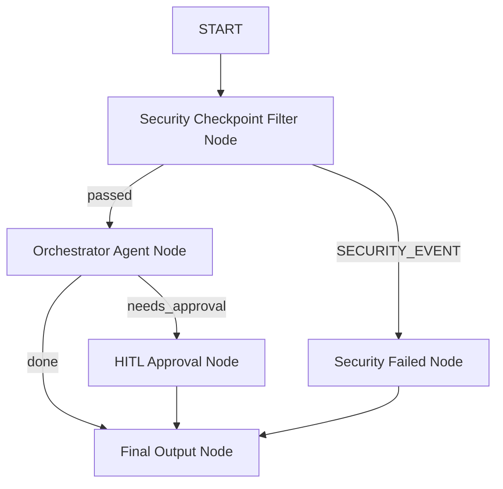

# Attention Span Recorder — Submission Write-Up

## 1. Problem Statement
Smartphones and productivity apps have created a hyper-distracted society. Excessive usage of entertainment, social media, and gaming apps (like Instagram, TikTok, and YouTube) drains user focus, causes procrastination, and decreases cognitive control. Existing solutions are either generic blocking tools or basic timers.

The **Attention Span Recorder** solves this by providing a comprehensive, intelligent assistant that monitors app usage, issues distraction warning indicators, gamifies focus sessions (via XP, levels, coins, badges, and streaks), and delivers personalized productivity recommendations.

---

## 2. Solution Architecture

The solution uses the **ADK 2.0 Workflow API** to build a structured multi-agent graph with specialized duties and secure checkpoints.

---

## 3. Concepts & File References

*   **ADK Workflow**: Coordinates execution logic and handles state propagation across nodes. Ref: [app/agent.py](app/agent.py#L313-L330).
*   **LlmAgent**: Configures specific instructions for the specialized agents. Ref: [app/agent.py](app/agent.py#L115-L171).
*   **AgentTool**: Delegates orchestrator responsibilities to specialized sub-agents. Ref: [app/agent.py](app/agent.py#L167-L170).
*   **MCP Server (Model Context Protocol)**: Exposes local python tools via stdio transport. Ref: [app/mcp_server.py](app/mcp_server.py).
*   **Security Checkpoint**: Intercepts inputs to scrub sensitive data, block prompt injections, and audit decisions. Ref: [app/agent.py](app/agent.py#L173-L229).
*   **Agents CLI**: Provided environment scaffolding and interactive developer playground capabilities.

---

## 4. Security Design
*   **PII Scrubbing**: Regex patterns scrub emails and SSNs. This prevents leaking personal user data to the LLM backend.
*   **Prompt Injection Blocking**: Keyword searches reject instructions aiming to hijack the system instructions.
*   **Domain Consent Check**: Limits processing of extremely long inputs if they do not match focus-related terminology (e.g. log, track, badge, session).
*   **Structured Auditing**: Decisions are categorized by severity (`INFO`, `WARNING`, `CRITICAL`) and appended as JSON objects in `ctx.state['audit_log']` to log potential security threats.

---

## 5. MCP Server Design
Exposes standard local tools using `FastMCP`:
*   `get_distraction_warning`: Evaluates if an application name matches standard distractions.
*   `get_productivity_tips`: Dynamically recommends level-appropriate advice for focus blocks.
*   `log_study_notes`: Saves student reflections after completing focus intervals.

---

## 6. Human-In-The-Loop (HITL) Flow
To prevent unauthorized or faulty redemption of coins, the `hitl_approval_node` intercepts requests. 
When a user asks to redeem coins, the workflow pauses, yields a `RequestInput` showing the validation request, and resumes only after receiving a clear response (`yes` / `no`). If approved, the system mutates the coins balance directly in state.

---

## 7. Demo Walkthrough (Playground Test Cases)
1.  **Start/Log Session**: Inputting `"Log a completed focus session of 30 minutes"` triggers `record_focus_session`, updates XP/level, and increments the coins balance.
2.  **Report Distraction**: Inputting `"I spent 15 minutes on Instagram"` logs app usage, triggers a distraction warning from the MCP server, and resets focus streak.
3.  **Redeem Badge (HITL)**: Inputting `"I want to redeem my coins for a Bronze Focus Badge"` triggers the approval interrupt, waiting for confirmation before completing.

---

## 8. Impact & Value Statement
Attention Span Recorder helps students and professionals build healthier digital habits. By introducing direct gamification and analytics directly alongside custom AI coaching, users have a structured method to track growth and reduce social media dependency, improving their overall attention spans.
